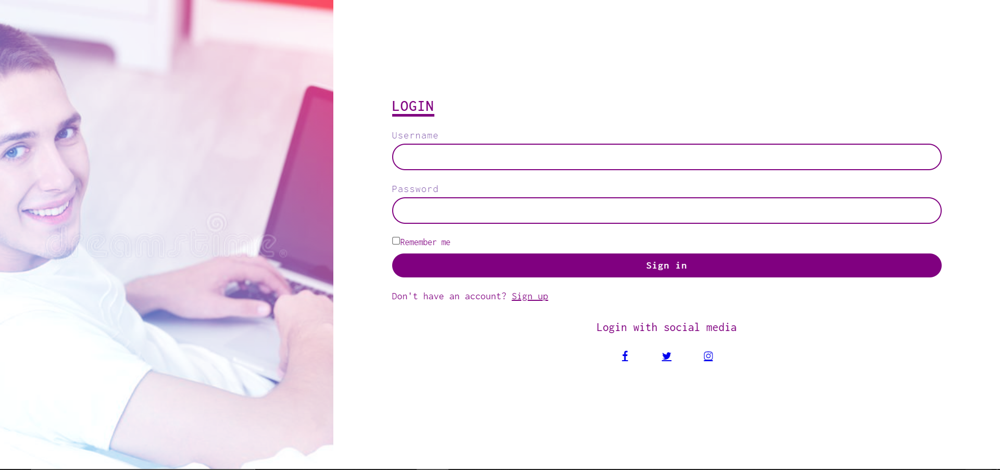

# **Login-Page**
> *In this repository i have tried to make an **responsive Login-page design*** using HTML & CSS.

## **Bullet-point of this Project.**
    * Making an Login-Page with some small effects.
    * using only CSS concept

## **Sample Image of My Login-page.**

 ***

*THANK YOU!* 😊
